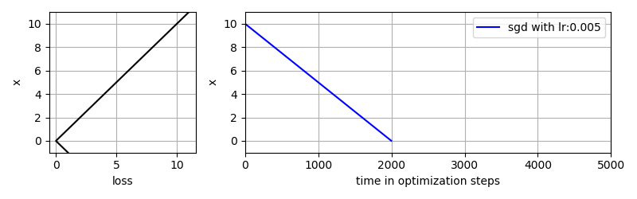
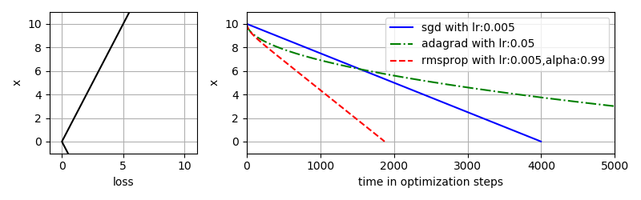
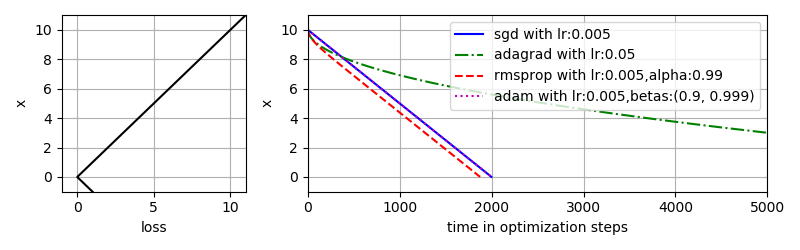

# About

This repository was used to analyze the behavior of four optimization methods (using torch):

- Stochastic Gradient Descent (SGD)
- Adaptive Gradient Algorithm (AdaGrad)
- Root Mean Square Propagation (RMSProp)
- Adaptive Moment Estimation (Adam)

 Please see my conclusions in the report below.

### How to use

Simply run `main.py` . It will create one or multiple images like the ones shown in the report below.

### Credits

Writing latex in Markdown files is not straightforward. Therefore, credits to two tools having helped with that:

- [Typora editor](https://typora.io/)
-  [TeXify Github App](https://github.com/agurodriguez/github-texify), which automatically converts any latex strings to an svg image upon pushing. See discussion on https://stackoverflow.com/questions/35498525/latex-rendering-in-readme-md-on-github .

# Report

### Notation

We use the following notation:

-  step at time t . Used for calculating 
-  = loss at time t
-  = derivative of loss with respect to x (at time t)
- = learning rate (constant parameter set by user)

Note that we only consider a one-dimensional (scalar) parameter  in order to simplify the discussion and visualization.

### Stochastic Gradient Descent (SGD)

The simplest optimizer is the stochastic gradient descent, which is defined as 

It will serve as our base optimizer for comparison.

For example, in the image below the loss function is a simple linear function . For linear functions the gradient  is constant and thus also the step size is constant .  If we start at  and have a learning rate  of , we need  steps to reach the minimum at  .

### Adaptive Gradient algorithm (AdaGrad)

AdaGrad is defined as followed

One characteristic of AdaGrad is that the step size reduces over time, since the denominator will only increase over time. This dampening effect can be seen in the image below. Such a damping may make sense for convex problems where we want to start off with large step sizes and take smaller steps once we reach the optimum. For nonconvex problems, this dampening is likely undesired.

A second characteristic of AdaGrad is that it is robust against scaling of the loss function, meaning the step size does not change if we scale the loss function with any constant. This can be very easily seen if the gradient   is approximately constant over time. Then, the equation simplifies to 

which shows that the step size is independent of the loss function! The image below shows again a linear line but this time with slope  instead of .  While SGD now takes twice as long to find the minimum, AdaGrad isn't affected by the scaling at all (compare with image above).

A third very important characteristic of AdaGrad is that the denominator  works for every parameter individually. For example, if we would not only have one parameter  to optimize, but multiples , the scaling  would be independent for each parameter. This is very beneficial in case of sparse data: The step size of sparse parameters will dampen much slower than the step size of frequent parameters.

### Root Mean Square Propagation (RMSProp)

RMSProp can be defined as followed

Similarly to AdaGrad, the step size is divided by a denominator. Contrary to AdaGrad, this denominator is not the cumulative sum which only increases, but instead an [exponential moving average](https://en.wikipedia.org/wiki/Moving_average#Exponential_moving_average) of the squared gradients. Therefore, the step size does not continually decrease like in Adagrad, but is rather approximately constant for a linear slope, see image below.

Similar to AdaGrad, if  is constant, we get   and thus  , implying robustness against scaling of the loss function as shown in the image below

The approximately constant step size is a very desired property in case of saddle points, where the gradient becomes very small. SGD will spent a lot of time on such saddle points, while RMSProp is able to overcome them quickly, see image below. The slope in the saddle is only  compared to a slope of  everywhere else.

A closeup of the saddle point (see image below) reveals, that the step size in RMSProp is increasing the longer it stays in the saddle point. If the saddle would be longer, the step size would again reach   as before the saddle point. Another interesting observation is that RMSProp's step size after the saddle point () is even larger than the one before the saddle point (). This is because directly after the saddle point the denominator  is smaller than before the saddle point , while the gradient  is equal.

### Adaptive Moment Estimation (Adam)

Adam uses the same denominator  as RMSProp, but multiplied with the bias correction term  . Moreover, it also employs an exponential moving average of the gradient . 

Similar to RMSprop, the step size is robust to a scaling of the loss function and approximately constant for a  linear slope. In fact, for a linear slope, Adam's step is exactly constant and exactly equals SGD's step for slope  (see image below). While RMSprop's needs a slow ramp-up phase (the first ~50 steps) to reach a constant step size, Adam's step size is constant from the beginning. This is exactly the effect of the bias correction terms  and . It prevents the ramp-up phase visible for RMSProp and thus accelerates the optimization process.

The behavior in saddle points is also very similar to RMSProp. Adam's exact behavior depend a lot on the parameters  and , so the images below show two different settings.

The most important difference compared to RMSProp can be seen in case of local minima (around  in the image below). SGD, Adagrad and RMSProp will get stuck in such local minima. In contrast, Adam is able to overcome those (up to a certain degree). 

There is a variant of RMSProp called RMSProp with momentum, which is also able to overcome local minima. A detailed comparison between RMSProp with momentum and Adam is presented in the following thread: https://datascience.stackexchange.com/questions/26792/difference-between-rmsprop-with-momentum-and-adam-optimizers/39224

